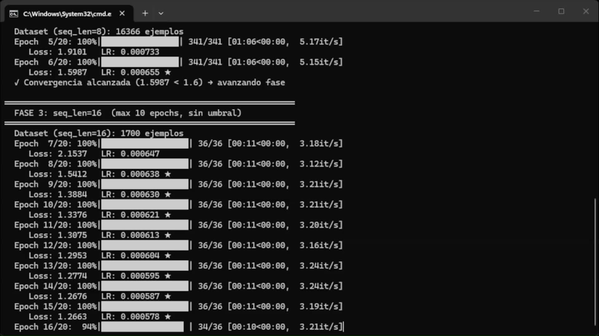
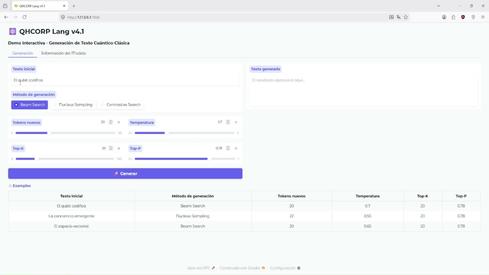
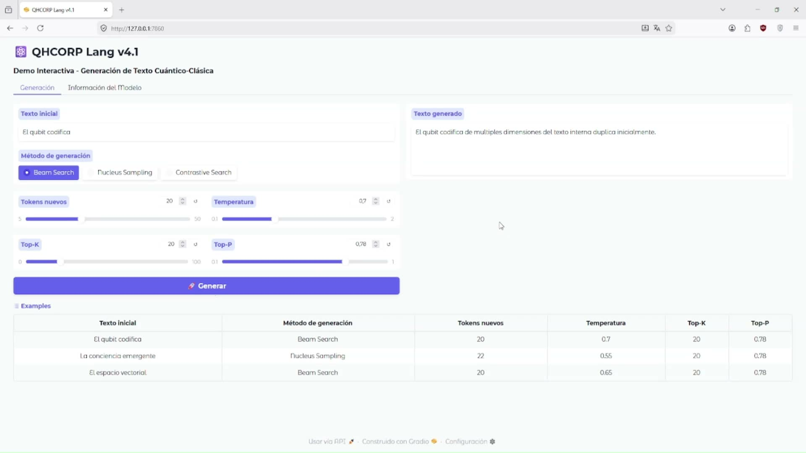

<div align="center">

# ⚛️ QHCORP Lang v4.1

### *Quantum Hernán Cofré-Pereira Organization for Research & Programming*
**"Quantum Intelligence, Built by Human Vision."**

---

**Autor:** Hernán Andrés Cofré Pereira
**Organización:** QHCORP Technologies
**Versión:** 4.1 · 2026
**Contacto:** adm8god@gmail.com · WhatsApp: +56985001427

---

**Versión en español:**
QHCORP Lang v4.1 es un modelo de lenguaje híbrido cuántico-clásico **completo y funcional**, con **código fuente completo**, arquitectura moderna, entrenamiento en CPU y todo lo necesario para experimentar, investigar y crear tus propios modelos locales de forma seria.

Incluye RoPE, GeGLU FFN, LoRA integrado, cuantización 4/8-bit, interfaz Gradio profesional y entrenamiento con Curriculum Adaptativo. Todo está documentado y listo para que lo estudies, modifiques y expandas.

---

*Hybrid Quantum-Classical Language Model — CPU-only · RoPE · GeGLU · Curriculum Adaptativo*

</div>

---

## 🎥 Demo en Vivo

**[▶ Ver Demo QHCORP Lang v4.1](https://files.catbox.moe/1hb1qn.mp4)**

*Entrenamiento con Curriculum Adaptativo + Interfaz Gradio + Generación en CPU*

---

## 📸 Capturas

### Entrenamiento en CPU con Curriculum Adaptativo

*~20–25 minutos en CPU estándar. Sin GPU necesaria.*

### Interfaz Web Gradio

*Demo interactiva local. Ejecuta con `--demo`.*

### Generación de Texto (3 métodos)

*Beam Search · Nucleus Sampling · Contrastive Search*

---

## ✨ ¿Por qué QHCORP Lang?

Existen modelos open source con miles de millones de parámetros disponibles gratis. QHCORP Lang no compite con ellos en tamaño — compite en algo diferente: **es uno de los pocos frameworks públicos con un circuito cuántico real integrado como capa de embedding**, construido desde cero, con código fuente completo y documentado, que corre en cualquier CPU sin nube, sin suscripción y sin dependencias externas. No es un wrapper. No es un fine-tune. Es arquitectura original, y el código es tuyo para estudiarlo, modificarlo y construir encima de él.

- ⚛️ **Arquitectura híbrida única** — Circuito cuántico real integrado como capa de embedding (PennyLane). No es un wrapper de otro modelo.

- ⚡ **CPU-only** — Entrena en ~20–25 min en cualquier laptop. Sin GPU, sin cloud.
- 🧠 **LoRA fine-tuning** — Adapta el modelo a tus propios datos en minutos
- 🔢 **Cuantización 4-bit / 8-bit** — Para hardware limitado
- 🌐 **Interfaz Gradio incluida** — Usa el modelo desde el navegador (`--demo`)
- 🔒 **100% local y privado** — Sin telemetría, sin API externa, sin suscripción
- 🛠️ **Código fuente completo** — ~1.7M parámetros, completamente documentado y modificable
- 📚 **Corpus de 15 dominios** — +7.000 frases únicas (física cuántica, IA, filosofía, matemáticas, biología y más)

**~1.7M parámetros · CPU-only · RoPE · GeGLU · Curriculum Adaptativo · Contrastive Search**

---

## 📦 ¿Qué recibes exactamente al comprar?

Al adquirir QHCORP Lang v4.1 recibes:

- ✅ Código fuente completo (qhcorp_lang_v4.py – ~3.000 líneas documentadas)
- ✅ Modelo entrenado (qhcorp_lang_v4_best.pt)
- ✅ README detallado con arquitectura completa y explicaciones
- ✅ Scripts listos: entrenamiento, fine-tuning con LoRA, generación por lotes y exportación
- ✅ Interfaz web Gradio profesional incluida
- ✅ Corpus de entrenamiento de 15 dominios (+7.000 frases)
- ✅ Licencia de uso perpetuo (personal, educativo, investigación y uso comercial)
- ✅ Documentación interna detallada + comentarios de arquitectura en el código

---

## 🧠 Arquitectura

```
Token Embedding
    → RoPE Positional Encoding
    → QuantumEmbeddingLayer  (circuito cuántico 1× por forward — ×16 más rápido)
    → 4× SemanticTransformerBlock  (GeGLU FFN — usado en PaLM, LLaMA, Mistral)
    → LayerNorm → LM Head (weight-tied)
```

- **RoPE** (Rotary Positional Encoding) — mejor coherencia en secuencias largas
- **GeGLU FFN** — gate semántico que aprende qué información dejar pasar
- **Curriculum Adaptativo** — entrenamiento por fases con umbral de convergencia
- **Gradient Accumulation ×4** — batch efectivo de 192 sin más RAM
- **Watermark criptográfico** — el modelo lleva una firma SHA-256 embebida en sus pesos con los datos de autoría de QHCORP Technologies. Si el código o el modelo entrenado es redistribuido o revendido sin autorización, la firma prueba que el trabajo original es de Hernán Andrés Cofré Pereira. Puedes usar, modificar y expandir el código libremente — lo que no puedes hacer es venderlo o publicarlo como propio.

---

## 💡 ¿Qué puedes hacer con QHCORP Lang?

- Entrenar un modelo de lenguaje local con tus propios datos
- Experimentar con arquitecturas híbridas cuántico-clásicas
- Investigar generación de texto con Beam Search, Nucleus Sampling y Contrastive Search
- Aprender el funcionamiento interno de un Transformer desde el código fuente
- Prototipar asistentes o generadores de texto privados
- Usar como base para investigación en NLP experimental o computación cuántica aplicada

---

## 🚀 Comandos principales

```bash
# Entrenar desde cero (~20–25 min en CPU)
python qhcorp_lang_v4.py

# Generar texto con modelo entrenado
python qhcorp_lang_v4.py --load qhcorp_lang_v4_best.pt --generate "el qubit codifica"

# Interfaz web interactiva
python qhcorp_lang_v4.py --demo

# Fine-tuning con tus datos
python qhcorp_lang_v4.py --finetune mis_datos.txt

# Exportar modelo completo
python qhcorp_lang_v4.py --export-dir ./mi_modelo/

# Guía de inicio rápido
python qhcorp_lang_v4.py --quickstart
```

---

## 💰 Precio

<div align="center">

### Precio de Lanzamiento: **$230 USD**
**Early Bird** (primeras 15 copias): **$199 USD**
*Después del lanzamiento oficial: $299 USD*

**[➜ Adquirir en Gumroad](https://admire044.gumroad.com/l/lsmyo)**

*Pago seguro · Entrega inmediata · Una sola compra para siempre*

</div>

---

## ⚙️ Requisitos

| Requisito | Mínimo |
|-----------|--------|
| Python | 3.9+ |
| RAM | 4 GB |
| CPU | Cualquier x86-64 |
| OS | Windows / Linux / macOS |
| GPU | ❌ No necesaria |

```bash
pip install pennylane torch tqdm gradio
```

---

## 📖 Cómo citar este trabajo

Si usas QHCORP Lang en publicaciones, tesis o proyectos públicos, cita al autor:

**Formato APA:**
```
Cofré Pereira, Hernán Andrés. (2026). *QHCORP Lang v4.1* (Version 4.1) [Software]. QHCORP Technologies. https://github.com/adm8god-ai/QHCORP-Lang-v4.1
```

**Formato BibTeX:**
```bibtex
@software{cofre2026qhcorplang,
  author       = {Cofré Pereira, Hernán Andrés},
  title        = {QHCORP Lang: Hybrid Quantum-Classical Language Model},
  version      = {4.1},
  year         = {2026},
  organization = {QHCORP Technologies},
  url          = {https://github.com/adm8god-ai/QHCORP-Lang-v4.1}
}
```

> Si compartes resultados, benchmarks o derivados en redes sociales o foros, menciona a **@adm8god-ai** (GitHub) o incluye el enlace al repositorio y la organización **QHCORP Technologies**.

---

## ❓ Preguntas Frecuentes

**¿Funciona en Windows?**
Sí. Compatible con Windows, Linux y macOS. Solo necesitas Python 3.9+ y 4 GB de RAM.

**¿Tengo que entrenarlo yo o viene el modelo ya entrenado?**
Recibes ambos: el código fuente para entrenar desde cero *y* el modelo ya entrenado (`qhcorp_lang_v4_best.pt`) listo para usar con `--generate` o `--demo` desde el primer minuto.

**¿Puedo usarlo en un proyecto comercial propio?**
Sí. La licencia incluye uso comercial propio. Lo que no puedes hacer es redistribuir o revender el código fuente a terceros.

**¿Puedo modificar la arquitectura y expandirla?**
Sí, ese es exactamente el propósito. El código está documentado para que lo estudies, modifiques y construyas encima de él.

**¿El watermark me rastrea o envía datos a internet?**
No. El watermark es una firma criptográfica SHA-256 con los datos de autoría de QHCORP Technologies, embebida en los pesos del modelo. No hay telemetría, no hay llamadas externas, nada se envía a ningún servidor. Su función es probar la autoría original del trabajo si alguien intenta redistribuirlo o venderlo sin autorización.

**¿Hay reembolsos?**
Al tratarse de código fuente digital de entrega inmediata, no se ofrecen reembolsos una vez descargado. Si tienes dudas antes de comprar, escríbeme a adm8god@gmail.com.

---

## 📜 Licencia

QHCORP Lang v4.1 es **software propietario con licencia de uso comercial incluida**.

La adquisición otorga una **licencia de uso perpetuo** para fines:
- ✅ Personales
- ✅ Educativos
- ✅ Investigación académica
- ✅ Uso comercial propio

**Queda expresamente prohibido:**
- ❌ Redistribuir o revender el código fuente
- ❌ Publicar el código en repositorios públicos
- ❌ Sublicenciar o ceder el acceso a terceros
- ❌ Usar el trabajo sin atribuir al autor original en publicaciones

---

<div align="center">

**Para quienes construyen IA, no solo la usan.**

Arquitectura híbrida cuántico-clásica original. Código fuente completo. 100% local, modificable y tuyo.

**[➜ Comprar ahora por $199 (Early Bird)](https://admire044.gumroad.com/l/lsmyo)**

*Solo 15 copias a este precio. Después sube a $299.*

</div>

---

<div align="center">

⚛️ **QHCORP Technologies**
*Quantum Hernán Cofré-Pereira Organization for Research & Programming*
**"Quantum Intelligence, Built by Human Vision."**

© 2026 Hernán Andrés Cofré Pereira · adm8god@gmail.com

*Primer producto de una marca construida para durar.*

</div>
